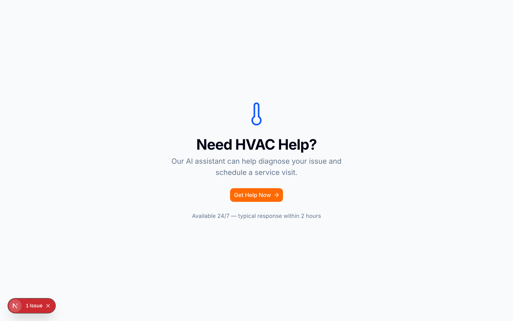
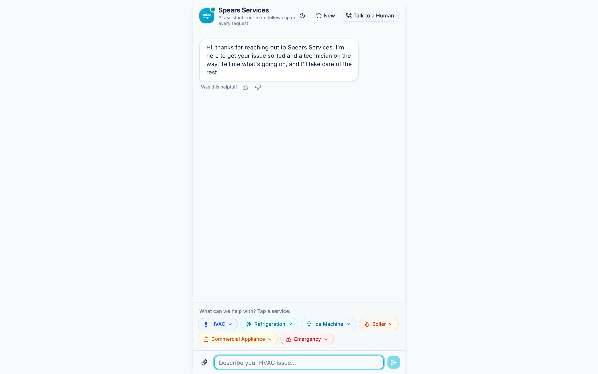
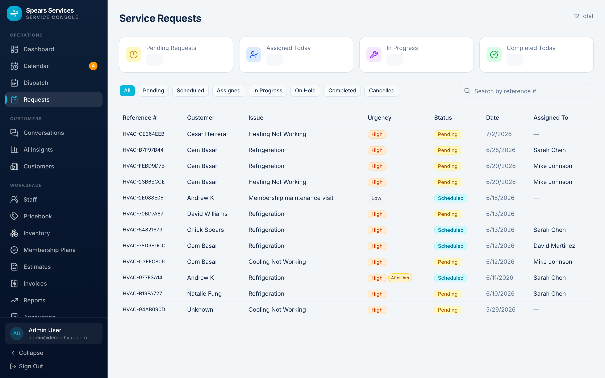
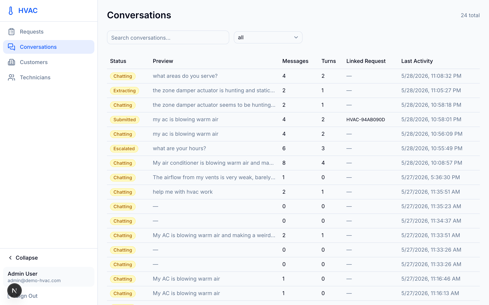
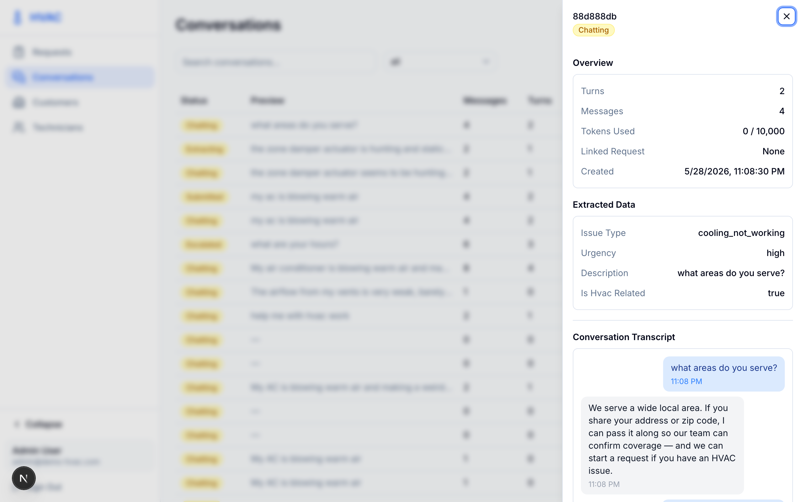
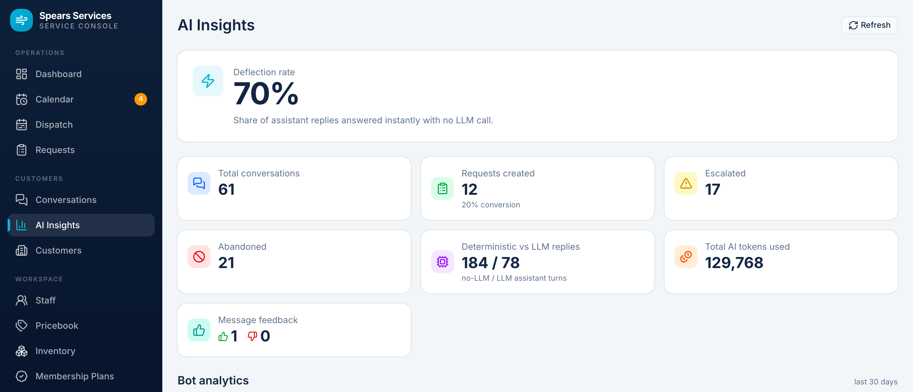

# AI HVAC Agent — User Guide & Product Overview

> 💡 **Tip:** Prefer the interactive version? Run the app and open
> [`/docs.html`](http://localhost:3000/docs.html) — it has a searchable sidebar
> (press `/`), light/dark mode, copy-to-clipboard code blocks, a reading-progress
> bar, and live screenshots.

## What This Is

An AI-powered customer service agent for HVAC companies. Customers describe their heating/cooling problem in a chat, the AI extracts a structured service request (issue type, urgency, address, contact info), and admins manage the queue from a dashboard. Built with Next.js 16, Qwen (via DashScope), and Neon PostgreSQL.

---

## Quick Start

### Prerequisites

- Node.js 20+
- A Neon PostgreSQL database (free tier works)
- A DashScope API key from Alibaba Cloud (for Qwen AI)

### Run Locally

```bash
cd ai-hvac-agent
npm install
npm run db:migrate    # create tables
npm run db:seed       # seed demo data
npm run dev           # start at http://localhost:3000
```

### Environment Variables (`.env.local`)

| Variable | What it does |
|---|---|
| `DATABASE_URL` | Neon PostgreSQL pooled connection string |
| `AI_BASE_URL` | DashScope OpenAI-compatible endpoint |
| `AI_API_KEY` | Your DashScope API key |
| `AI_MODEL` | Model name (default: `qwen-plus`) |
| `ENCRYPTION_KEY` | 32-byte hex key for AES-256-GCM PII encryption |
| `AUTH_SECRET` | JWT signing secret for admin auth (min 32 chars) |
| `CRON_SECRET` | Secret for the session cleanup cron job |

Generate secrets with: `openssl rand -hex 32`

---

## Using the App

### Customer Flow (Public)

**1. Landing Page** — `http://localhost:3000`

The entry point. A single "Get Help Now" button sends customers into the AI chat. Designed mobile-first — centered layout, large tap target, 24/7 availability messaging.



**2. AI Chat** — `http://localhost:3000/chat`

This is where the AI conversation happens:

- A session is created automatically when the page loads
- The customer describes their HVAC issue in natural language
- The AI asks follow-up questions to collect: issue type, urgency, address, name, phone, email
- **Extraction pills** appear at the top as each field is collected (Issue Type, Urgency, Address) — giving the customer visual progress feedback
- Once all fields are collected, an **extraction card** appears showing the full summary
- The customer reviews and clicks "Confirm & Submit"
- A **confirmation dialog** gives one final review before submitting


*The chat now shows a "Step X of 3" intake stepper with per-field check chips, contextual suggested-reply chips, a 👍/👎 "Was this helpful?" control under assistant answers, and an "AI assistant · a technician follows up within 2 hrs" header subtitle. See [Customer Chat Experience](#customer-chat-experience-stage-1) below.*

**Guardrails built in:**
- 2000-character message limit
- Input sanitization (prompt injection prevention)
- Token budget per session (prevents runaway AI costs)
- 15-turn escalation hint (suggests human handoff if conversation is long)
- Rate limiting per IP

#### Deterministic Answers & Token Savings

Most customer turns never reach the language model. Before any message hits Qwen, a deterministic **intent router** matches it against a 65-intent knowledge base:

- **Common questions, greetings, emergencies, and slot collection** are answered instantly with **0 LLM tokens** — canned FAQ answers, safety/escalation text, and regex extraction of phone/email/address.
- **Novel or ambiguous input** (open-ended problem descriptions, compound messages, account lookups) falls back to the Qwen `streamText()` path.

The chat endpoint used to make **2 LLM calls per turn** (one for the reply, one for extraction). On a matched deterministic turn that drops to **0** — a large cut in token cost across a typical conversation. The whole layer can be disabled with a single `ROUTER_ENABLED` flag, and the LLM fallback is always reachable. See [docs/COMMON-QUESTIONS-PLAN.md](docs/COMMON-QUESTIONS-PLAN.md) and [docs/TOKEN-SAVINGS.md](docs/TOKEN-SAVINGS.md).

#### Customer Chat Experience (Stage 1)

A trust- and transparency-focused pass over the chat, drawn from leading support bots (Intercom, Zendesk, Drift) and NN/G + accessibility guidance:

- **AI disclosure + "Talk to a Human anytime"** in the greeting — the first bubble states it's an AI that can make mistakes and that a human is one tap away. Zero runtime cost.
- **Intake progress stepper** — "Step X of 3" with a progress bar and per-field check chips, replacing the flat extraction pills, so the 3-field intake reads as a finish line.
- **Contextual suggested-reply chips** after a bot turn — issue shortcuts plus a one-tap human handoff, so the customer rarely has to type.
- **"Was this helpful? 👍/👎"** under assistant answers → `POST /api/session/feedback`, stored in `audit_log` as a deflection-quality signal (no new tables).
- **Accessibility** — the message region is a `role="log"` with `aria-live="polite"`, animations are gated behind `prefers-reduced-motion`, and each new assistant message scrolls its *top* into view.
- **Branded typing indicator** — "HVAC Assistant is typing…" appears only on the LLM-fallback path, so canned 0-token replies never fake latency.
- **Clearer handoff copy** — a header subtitle ("AI assistant · a technician follows up within 2 hrs") plus an escalation dialog that states what happens next, with tap-to-call.

#### Conversation Resume & Token Savings (Stage 2)

- **Resume across refresh** — the httpOnly session cookie persists, so a refresh rehydrates the transcript and extracted slots from `GET /api/session` instead of starting over. Terminal/submitted sessions start fresh.
- **Token-cost hardening** — chat output is capped at `maxOutputTokens: 350`, and only the last 10 messages are sent to the model on both the chat and extraction calls, keeping cost-per-turn flat in long conversations.

**3. Escalation** — "Talk to a Human" button in the chat header

If the customer prefers human help, they can escalate at any time. This shows a phone number and marks the session as `escalated`.

**4. Success Page** — `http://localhost:3000/chat/success?ref=REF-XXXXX`

After confirmation, the customer sees their reference number and a promise that a technician will reach out within 2 hours.

### Admin Flow (Protected)

**1. Login** — `http://localhost:3000/admin/login`

Default credentials (change after first login):
- Email: `admin@demo-hvac.com`
- Password: `admin123`

**2. Service Requests Dashboard** — `http://localhost:3000/admin/requests`

The main admin screen. Shows:

- **Stats cards** (auto-refresh every 30s):
  - Pending Requests (yellow)
  - Assigned Today (blue)
  - In Progress (purple)
  - Completed Today (green)

- **Filter bar**: All | Pending | Assigned | In Progress | Completed | Cancelled

- **Request table**: Reference #, Customer, Issue, Urgency (color-coded), Status, Date, Assigned To

- **Request detail sheet** (click any row): Slides in from the right showing:
  - Customer information (name, phone, email, address)
  - Issue details (type, description)
  - Technician assignment dropdown
  - Full conversation transcript (user messages in blue, AI in gray)



**3. Technician Management** — `http://localhost:3000/admin/technicians`

- View all technicians in a table (name, email, status, join date)
- **Add Technician**: Click "+ Add Technician", fill in name/email/password
- **Edit Technician**: Click "Edit" to change name, email, or toggle active/inactive
- Only active technicians appear in the assignment dropdown on service requests

**4. Conversations** — `http://localhost:3000/admin/conversations`

A searchable log of **every** saved customer chat — including sessions that never became a service request. Each entry opens a detail sheet with the full transcript and any extracted data. It reads directly from the `customer_sessions` and `messages` tables, so nothing a customer typed is ever lost, regardless of how the conversation ended.





**5. AI Insights** — `http://localhost:3000/admin/insights`

A dashboard for how the AI is performing, computed entirely from existing tables (backed by `GET /api/admin/ai-insights`, no schema change):

- **Deflection rate** (headline) — the share of assistant replies answered with **0 LLM tokens**.
- **Funnel** — conversations → requests created (with conversion %), escalated, and abandoned.
- **Deterministic-vs-LLM** reply counts and **total AI tokens used**.
- **👍/👎 feedback** tallies from the new helpfulness control.



### Session States

Each customer chat session moves through these states:

```
chatting → extracting → confirmed → submitted
                ↘ escalated
                ↘ abandoned (timeout)
```

- **chatting**: Active conversation
- **extracting**: AI is collecting structured fields
- **confirmed**: Customer reviewed and confirmed the extraction
- **submitted**: Service request created and visible to admins
- **escalated**: Customer requested human help
- **abandoned**: Session expired (cleaned up by daily cron)

---

## Architecture

```
src/
├── app/                          # Next.js App Router pages
│   ├── page.tsx                  # Landing page
│   ├── chat/
│   │   ├── page.tsx              # AI chat interface
│   │   └── success/page.tsx      # Post-submission confirmation
│   ├── admin/
│   │   ├── login/page.tsx        # Admin authentication
│   │   └── (dashboard)/
│   │       ├── requests/page.tsx # Service request queue
│   │       └── technicians/page.tsx # Technician management
│   └── api/
│       ├── chat/route.ts         # Streaming AI chat endpoint
│       ├── session/              # Session create, confirm, escalate
│       ├── auth/                 # Login, logout
│       ├── admin/                # Stats, requests, technicians CRUD
│       └── cron/cleanup/route.ts # Daily session cleanup
├── components/
│   ├── chat/                     # 11 chat UI components
│   ├── admin/                    # 9 dashboard components
│   └── ui/                       # Shared primitives (Button, Card, etc.)
├── hooks/
│   ├── use-chat-session.ts       # Chat state, streaming, extraction tracking
│   ├── use-admin-requests.ts     # Request list with 10s polling
│   └── use-admin-technicians.ts  # Technician list
└── lib/
    ├── ai/                       # AI provider, extraction, guardrails, metrics
    ├── db/                       # Drizzle schema, migrations, seed
    └── ...                       # Auth, encryption, logging, rate limiting
```

### Key Design Decisions

- **PII encryption**: Customer names, phones, emails, and addresses are encrypted at rest with AES-256-GCM. The `ENCRYPTION_KEY` is required to decrypt.
- **Multi-tenant**: All queries are scoped by `organization_id` via a `withTenant()` helper. The demo uses a single org, but the schema supports multiple.
- **Streaming**: Chat responses stream token-by-token via the Vercel AI SDK's `streamText()`. Extraction runs in the `onFinish` callback after the stream completes.
- **Token budget**: Each session has a configurable token budget to prevent cost overruns.

---

## Deployment (Vercel)

See [DEPLOY.md](./DEPLOY.md) for the full runbook. The short version:

1. Connect this repo to Vercel
2. Set all env vars in the Vercel dashboard
3. Push to `main` — Vercel auto-deploys
4. The `vercel.json` configures a daily cron job at 3 AM UTC for session cleanup

---

## Roadmap

### What's Next — simple wins from chatbot research

Research into leading support chatbots (Intercom, Zendesk, Drift, Tidio, plus NN/G and accessibility guidance) surfaced cheap, high-leverage UX patterns. **The top High-value / Small-effort wins have now shipped** — ✅ **AI disclosure in the greeting**, ✅ **👍/👎 on answers**, ✅ **contextual suggested-reply chips**, ✅ an **intake progress stepper**, ✅ **`aria-live` + reduced-motion accessibility**, ✅ **scroll-to-top of new messages**, ✅ **conversation resume across refresh**, ✅ **header/escalation handoff copy**, and ✅ a **branded typing indicator** — see [Customer Chat Experience (Stage 1)](#customer-chat-experience-stage-1) and [AI Insights](#5-ai-insights--httplocalhost3000admininsights). Full analysis and sources (including deliberately-skipped items) are in [docs/CHATBOT-BENCHMARKS.md](docs/CHATBOT-BENCHMARKS.md).

### Desktop App (Tauri)

Wrap the web app in a native desktop window using Tauri:
- ~5 MB binary (uses OS-native WebKit on macOS)
- Points at `localhost:3000` during dev, bundles production build for release
- Native window chrome, dock icon, auto-updater
- No Rust knowledge needed for the wrapper — just configuration

### CRM (Customer Relationship Management)

The current app treats each chat session independently. A CRM adds persistent customer profiles:

**New features:**
- **Customer profiles** — deduplicated from service request data (name, address, phone, email)
- **Equipment registry** — track installed HVAC units per customer (make, model, serial, warranty date)
- **Service history timeline** — all past requests linked to the customer with outcomes and tech notes
- **Follow-up reminders** — maintenance schedules, warranty expirations, post-service check-ins
- **Returning customer detection** — when a chat session matches an existing customer, pre-populate context so the AI gives better help

**New screens:**
- Customer list (searchable, filterable)
- Customer detail page (contact info, equipment tab, service history tab, notes tab)
- Follow-up queue (upcoming reminders across all customers)

**Reference designs:** ServiceTitan (industry leader — unified customer profile with equipment and job history on one screen), Housecall Pro (address-centric model, handles tenant turnover), Jobber (drag-and-drop scheduling from service history).

### UX Improvements

**Chat:**
- ✅ Quick-reply suggestion buttons (e.g., "AC not cooling", "Furnace won't start") — shipped as contextual suggested-reply chips
- ✅ Progress stepper showing where the customer is in the flow — shipped as the "Step X of 3" intake stepper
- ✅ Branded typing indicator with company name — shipped ("HVAC Assistant is typing…", LLM path only)

**Dashboard:**
- Kanban board view as an alternative to the table (drag requests between status columns)
- Technician workload visualization
- Customer satisfaction tracking post-service

**Design system:**
- Trust-oriented palette: deep navy/slate primary, warm orange accents, clean white backgrounds
- Consistent spacing scale and component library
- Motion design: subtle transitions for sheet slides, card entries, status changes
