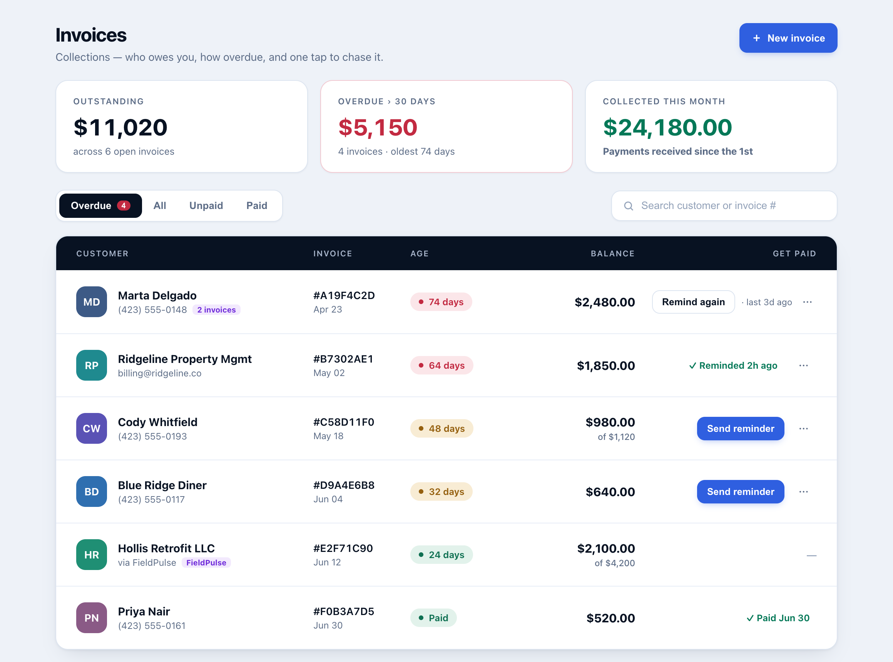
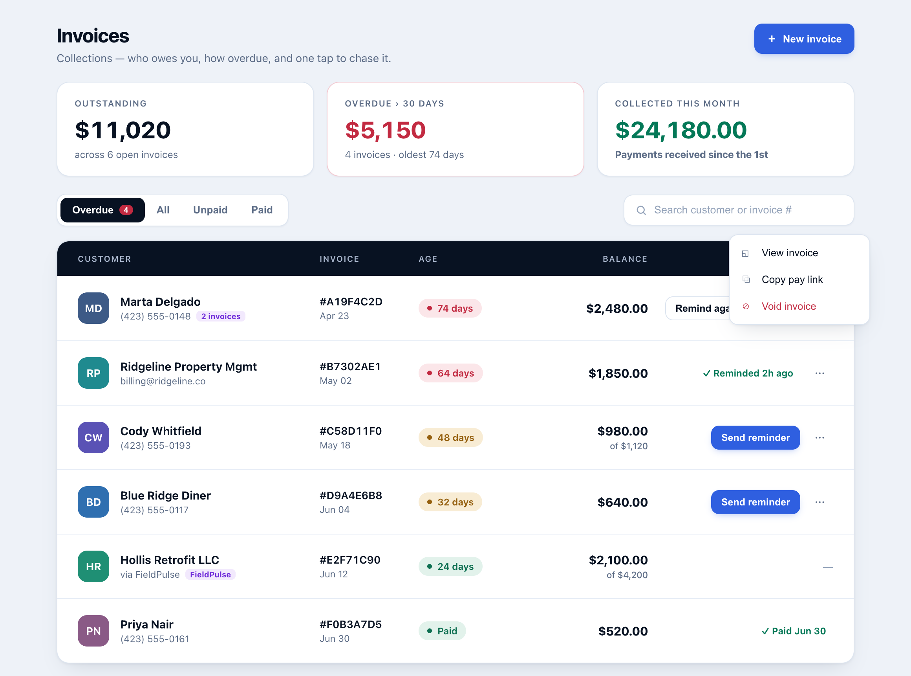
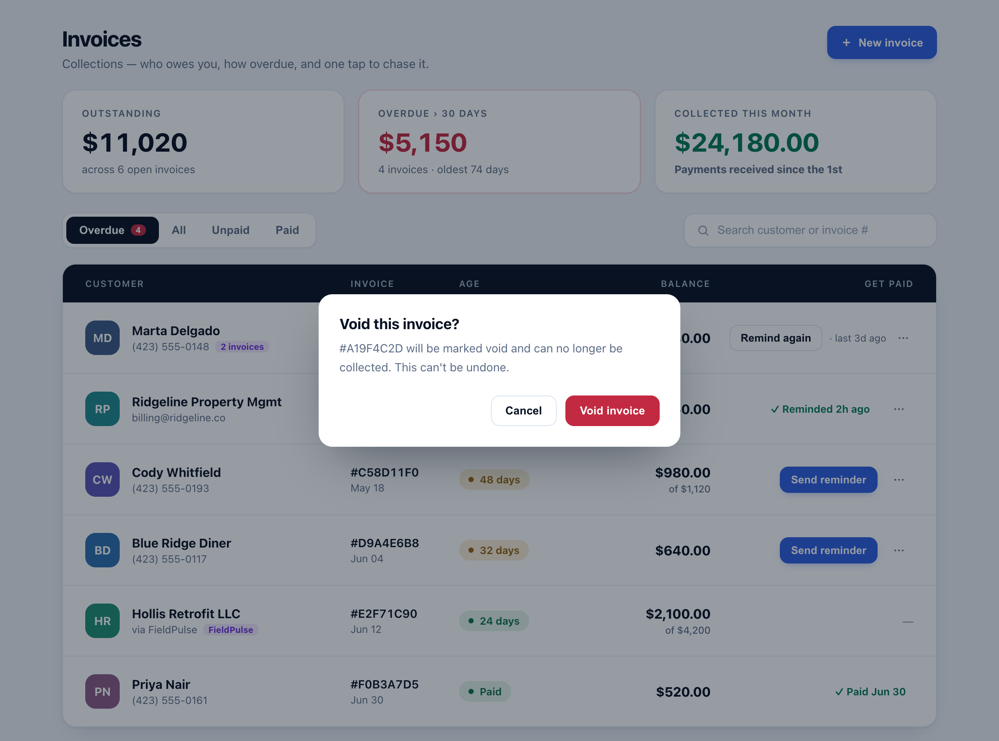
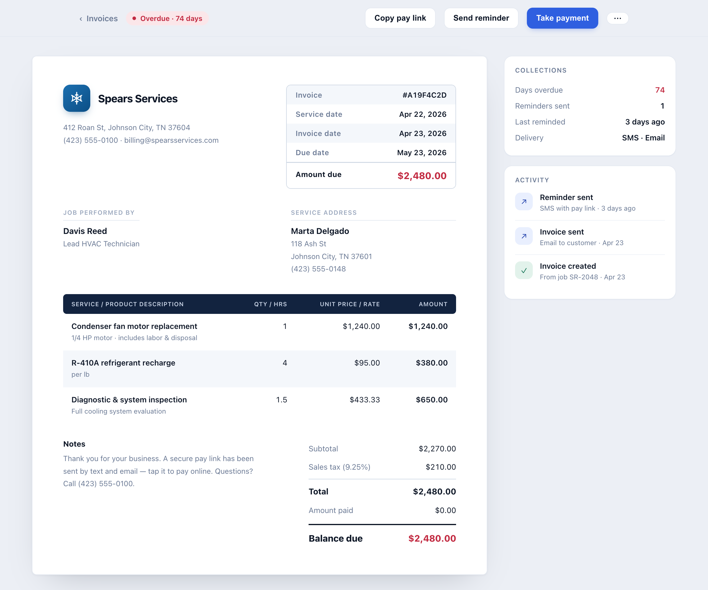

# Invoices & Collections

The **Invoices** area of the admin console is a *collections workspace*: it answers
"who owes us, how overdue are they, and what's the one action to get paid" at a glance,
and it doubles as a proper service-invoice viewer. It sits on top of the native
`invoices` money table and the read-only mirrors pulled from FieldPulse / Housecall Pro.

> The UI images below are reference renders built from the shipped component markup and
> Tailwind tokens (the admin pages are auth-gated and the demo seed carries no invoices,
> so these are rendered from the real component code rather than a live login).

---

## Contents

- [At a glance](#at-a-glance)
- [The collections model (business rules)](#the-collections-model-business-rules)
- [Screens](#screens)
- [Architecture & file map](#architecture--file-map)
- [Data model](#data-model)
- [Query reference](#query-reference)
- [HTTP API reference](#http-api-reference)
- [Reminders (one-click + automated sweep)](#reminders-one-click--automated-sweep)
- [Money-flow safety](#money-flow-safety)
- [UI states](#ui-states)
- [Testing](#testing)
- [Build & deploy notes](#build--deploy-notes)
- [Deferred / roadmap](#deferred--roadmap)

---

## At a glance

| Capability | Where |
|---|---|
| Aging summary (Outstanding / Overdue >30d / Collected this month) | List — summary band |
| Overdue-first list, filter (Overdue / All / Unpaid / Paid), search | List |
| One-click **Send reminder** (SMS + pay link), with 6h cooldown + re-chase | List row + detail toolbar |
| Row overflow `⋯` menu — **View invoice**, **Copy pay link**, **Void invoice** | List row |
| Real service-invoice **document** (itemized, totals, parties) | Detail |
| **Take payment** / refund | Detail toolbar |
| Collections sidebar (days overdue, reminders, activity timeline) | Detail |
| Read-only **synced** invoices (FieldPulse / Housecall Pro) | List + detail (money actions disabled) |

---

## The collections model (business rules)

These are the load-bearing definitions. They are enforced identically on the client
(list/summary/detail) and on the server (queries + endpoints) — the server never trusts
the UI gate.

- **Collectible** — an invoice belongs in collections and may be dunned **only when
  `state === 'open'` and `balance > 0`** (`balance = totalCents - amountPaidCents`).
  The state enum is `draft | open | paid | void | refunded`; only `open` is
  sent-and-owed. `paid`, `void`, `refunded`, and `draft` are **not** collectible.
  This matters because a **full refund** lands an invoice in `state='refunded'` with
  `totalCents` still set (so `balance > 0`) — without the state gate it would look owed
  and could be dunned. The single predicate is `isCollectible()` in
  `src/lib/admin/invoice-collectible.ts`.
- **Overdue is age-based.** There is no `due_date` column. An invoice is *overdue* when
  it is collectible **and** `createdAt` is more than **30 days** ago. Aging chips bucket
  by age: **0–30** (green), **31–60** (amber), **60+** (red). The detail page's
  "Due date" is display-only: `createdAt + 30 days`.
- **Reminder cooldown is 6 hours** (`REMINDER_COOLDOWN_MS`, shared client+server from the
  pure module). A manual reminder is refused within 6h of the last send; after 6h the
  list offers **Remind again**.
- **Void is terminal and guarded.** An invoice may be voided **only when it is native
  (not synced) AND `state ∈ {open, draft}` AND `amountPaidCents === 0`.** An invoice with
  any recorded payment must be refunded, not voided. There is no un-void.
- **Synced invoices are read-only.** Any invoice mirrored from FieldPulse / Housecall Pro
  (`syncedSource !== null`) has all money mutations disabled — no reminder, no pay-link,
  no void, no payment. The money is owned by the external FSM.

---

## Screens

### Collections list — `/admin/invoices`



The summary band shows three tiles: **Outstanding** (sum of collectible balances),
**Overdue > 30 days** (collectible + age ≥ 30, with the oldest age), and
**Collected this month** (sum of this month's succeeded payments — a server aggregate).
Rows are sorted overdue-first; each shows the customer (decrypted name + contact), the
canonical invoice ref (`#` + first 8 of the id, uppercased), the created date, an age
chip, the balance (with "of $total" when partially paid), and the **Get paid** action
rail. The row for a synced invoice shows the source pill (e.g. `FieldPulse`) and no money
actions (`—`).

### Row overflow menu



The `⋯` menu (Base UI `DropdownMenu`) carries **View invoice**, **Copy pay link** (mints a
portal token and copies the pay URL; native invoices only), and the destructive
**Void invoice** (native, non-terminal invoices only).

### Void confirmation



Voiding is a terminal money-state change, so the `⋯` item only *opens* a confirmation
dialog — the void fires solely from the dialog's destructive **Void invoice** button.
The dialog names the invoice and states it can't be undone.

### Invoice detail — `/admin/invoices/[id]`



A real service-invoice **document**: company lockup, meta box (invoice #, service date,
invoice date, due date, amount due), **Job performed by** (technician) + **Service
address** (customer), a dark-header itemized table, notes, and totals with the balance
due emphasized. The sticky **Collections** sidebar shows days overdue, reminders sent,
last reminded, and delivery channels; the **Activity** timeline is built from real events
(invoice created / sent / reminded). The toolbar carries **Copy pay link**,
**Send reminder**, **Take payment**, and `⋯` — all hidden/disabled for synced invoices.

---

## Architecture & file map

```
Backend (server-only)
  src/lib/admin/invoice-queries.ts        listInvoices, getInvoiceDetailById,
                                          getInvoiceOrgIdentity, getInvoiceCustomerId,
                                          collectedThisMonthCents, voidInvoice,
                                          takePayment, refundPayment, createInvoiceFromSoldEstimate
  src/lib/communication/money-triggers.ts sendInvoiceReminder (manual, atomic cooldown),
                                          sendOverdueInvoiceReminders (cron sweep),
                                          invoiceRef re-export
  src/app/api/admin/invoices/route.ts               GET list (+ collectedThisMonthCents), POST create
  src/app/api/admin/invoices/[id]/route.ts          GET detail (+ org identity)
  src/app/api/admin/invoices/[id]/send-reminder/    POST manual reminder
  src/app/api/admin/invoices/[id]/pay-link/         POST mint portal pay link
  src/app/api/admin/invoices/[id]/void/             POST void (guarded)
  src/app/api/admin/invoices/[id]/payments/         POST take payment / refund

Pure (client-safe — NO db / server-only imports)
  src/lib/admin/invoice-collectible.ts    isCollectible(), REMINDER_COOLDOWN_MS,
                                          invoiceRef(), canResend()

Client
  src/hooks/use-invoices.ts               list + collectedThisMonthCents + sendReminder + voidInvoice
  src/app/admin/(dashboard)/invoices/page.tsx        list page (filters, search, flash, void dialog)
  src/app/admin/(dashboard)/invoices/[id]/           detail page
  src/components/admin/invoices/
    summary-band.tsx        3-tile aging band
    age-chip.tsx            ageBucket / daysBetween (pure)
    invoice-row.tsx         a list row (rail states + ⋯ menu)
    invoice-document.tsx    the invoice document  (+ invoice-document-model.ts, pure)
    invoice-collections-side.tsx  detail sidebar   (+ invoice-activity.ts, pure)
    invoice-detail-client.tsx     detail layout + money handlers
```

**Why the pure module exists:** client components must never import a module that pulls
`server-only` (it breaks the client bundle at `next build`). `money-triggers.ts` reaches
`server-only` via `portal-queries.ts`, so the helpers a client needs (`isCollectible`,
`invoiceRef`, `REMINDER_COOLDOWN_MS`, `canResend`) live in `invoice-collectible.ts`, which
has zero db/server-only imports. `money-triggers.ts` re-exports `invoiceRef` for its own
server callers.

---

## Data model

Relevant `invoices` columns (`src/lib/db/schema.ts`):

| Column | Type | Notes |
|---|---|---|
| `id` | uuid | invoice ref = `#` + `id.slice(0,8).toUpperCase()` |
| `organizationId` | uuid | tenant scope (every query `withTenant`-scoped) |
| `state` | enum | `draft \| open \| paid \| void \| refunded` |
| `totalCents` | int | invoice total |
| `amountPaidCents` | int | default 0; reconciled by `takePayment` / `refundPayment` |
| `customerId` | uuid | LEFT JOIN → decrypted customer name / contact |
| `serviceRequestId` | uuid | LEFT JOIN → technician + service date |
| `createdAt` | timestamptz | drives age-based overdue + display "due date" (+30d) |
| `lastReminderSentAt` | timestamptz | stamped by manual **and** cron reminders (migration `0030`) |
| `fieldpulseInvoiceId` | text | non-null ⇒ synced (read-only) |
| `hcpInvoiceId` | text | non-null ⇒ synced (read-only) |

`syncedSource` (`'fieldpulse' | 'housecall' | null`) is *derived* from the two mirror-id
columns via `deriveSyncedSource(...)` — it is not stored.

**Migration:** `drizzle/0030_acoustic_tusk.sql` adds `last_reminder_sent_at`. Migrations
run automatically on deploy.

---

## Query reference

All queries are `withTenant`-scoped; `organizationId` comes from the admin session, never
the client. Neon runs over HTTP — **no transactions, no row locks** — so money mutations
use an *atomic claim*: a guarded `UPDATE … WHERE <guards> RETURNING`, and if no row
returns, the guard failed.

| Function | Signature | Behavior |
|---|---|---|
| `listInvoices` | `(orgId) → InvoiceListItem[]` | LEFT JOINs customer (org-scoped), decrypts name, returns `syncedSource`, `lastReminderSentAt`. |
| `collectedThisMonthCents` | `(orgId, now?) → number` | Sum of `payments.amountCents` where `status='succeeded'` and `createdAt` in `[UTC month start, now]`. neon `sum()` returns a string → `Number()`-coerced. |
| `getInvoiceDetailById` | `(orgId, id) → InvoiceDetailView \| null` | LEFT JOINs customer / service request / technician; adds `customerName/Address/Phone`, `technicianName`, `serviceDate`, `lastReminderSentAt`. |
| `getInvoiceOrgIdentity` | `(orgId) → { companyName, address, phone }` | `companyName` from the column; `phone` parsed from the `businessInfo` JSONB (null if absent/malformed); `address` is null (no structured column). |
| `getInvoiceCustomerId` | `(orgId, id) → { customerId, syncedSource } \| null` | Lightweight lookup used by pay-link (rejects synced). |
| `sendInvoiceReminder` | `(orgId, id, now?) → { ok } \| { ok:false, reason }` | See [Reminders](#reminders-one-click--automated-sweep). Reasons: `not_found`, `not_collectible`, `no_phone`, `no_template`, `cooldown`. |
| `voidInvoice` | `(orgId, id, now?) → { ok } \| { ok:false, reason }` | Classify read → atomic guarded `UPDATE … WHERE state∈{open,draft} AND amountPaidCents=0 AND both sync-null RETURNING`. Reasons: `not_found`, `synced_read_only`, `not_voidable`, `has_payments`. |
| `takePayment` / `refundPayment` | — | Native payment capture / refund with atomic over-collection + idempotency guards; set `state` to `paid` / `open` / `refunded`. |

---

## HTTP API reference

All endpoints require an admin session (`getAdminSession` → 401) and are rate-limited
(`RATE_LIMITS.adminMutation` for writes / `adminRead` for reads → 429). Responses use the
standard envelope `{ success, data }` / `{ success:false, error:{ code } }`. Mutations are
audit-logged.

| Method & path | Purpose | Failure codes |
|---|---|---|
| `GET /api/admin/invoices` | List + `collectedThisMonthCents` | `UNAUTHORIZED` 401, `RATE_LIMITED` 429 |
| `POST /api/admin/invoices` | Create invoice from a sold estimate | — |
| `GET /api/admin/invoices/[id]` | Detail view + `{ org }` identity | 401 / 404 |
| `POST /api/admin/invoices/[id]/send-reminder` | Send SMS reminder (atomic 6h cooldown) | `NOT_FOUND` 404, `NOT_COLLECTIBLE` 400, `NO_PHONE`/`NO_TEMPLATE` 400, `COOLDOWN` 409 |
| `POST /api/admin/invoices/[id]/pay-link` | Mint a portal pay link (`{ payLink }`); refuses synced | `SYNCED_READONLY` 409, 404 |
| `POST /api/admin/invoices/[id]/void` | Void a native, unpaid, open/draft invoice | `NOT_FOUND` 404, `SYNCED_READONLY`/`NOT_VOIDABLE`/`HAS_PAYMENTS` 409 |
| `POST /api/admin/invoices/[id]/payments` | Take payment / refund | over-collection / idempotency guards |

---

## Reminders (one-click + automated sweep)

Two paths, one column (`lastReminderSentAt`) so the UI reflects both:

1. **Manual — `sendInvoiceReminder`** (one-click from the list/detail). The 6h cooldown is
   an **atomic claim-before-side-effect**: a guarded
   `UPDATE invoices SET lastReminderSentAt = now WHERE id/org AND (lastReminderSentAt IS
   NULL OR < now-6h) RETURNING` reserves the window; the SMS is queued only if a row
   returned; if the enqueue then throws, the prior stamp is restored (compensating write).
   The SMS carries a real portal pay link (`generatePortalToken`).
2. **Automated — `sendOverdueInvoiceReminders`** (weekly cron dunning sweep). Enqueues an
   `invoice_overdue` SMS for overdue collectible invoices **and stamps
   `lastReminderSentAt`** on each successful send — so the list chip and the detail
   Activity timeline reflect automated reminders (no double-chasing).

**List rail states** (all gated on `isCollectible && !synced`):

| State | Renders |
|---|---|
| never reminded | **Send reminder** button |
| reminded, within 6h cooldown | passive `✓ Reminded {rel}` chip |
| reminded, cooldown elapsed | **Remind again** button + `· last {rel}` caption |

---

## Money-flow safety

- **One collectibility definition.** `isCollectible()` governs the list filter, the
  summary math, the row rail, the detail toolbar, and the backend reminder guard. A void /
  refunded / paid / draft invoice consistently drops out of collections and is refused a
  reminder (`not_collectible`).
- **Void is defense-in-depth.** Even though the `⋯` item is UI-gated, the query re-checks
  every guard inside the atomic `UPDATE … RETURNING`, so a payment racing in between the
  read and the update flips the `WHERE` and the void cannot slip through. A direct POST to
  `/void` for a synced / paid / partially-paid invoice is refused with the right reason.
- **Synced invoices are read-only end-to-end** — reminder, pay-link, void, and payment all
  refuse `syncedSource !== null`.
- **Confirmation before void** — the terminal action requires an explicit dialog confirm.

---

## UI states

- **Filters:** Overdue (default, badge count) / All / Unpaid / Paid. Overdue and Unpaid use
  `isCollectible`; Paid is `state==='paid'`.
- **Age chip:** green ≤30, amber 31–60, red 60+; "Paid" chip for paid invoices.
- **Balance:** shows `balance`, plus "of $total" when partially paid; shows `total` for paid.
- **Synced pill:** `FieldPulse` / `Housecall Pro`; no money actions on the row.
- **Reminded chip** is a single text-node span (nesting inline elements in the flex rail
  blockifies the item to full width — a fixed design constraint).

---

## Testing

The repo runs Vitest in the **`node`** environment — there is **no `@testing-library/react`
and no jsdom**, so React components are **not** render-tested. The convention is to put
logic in exported **pure functions** and test those:

- `invoice-collectible.test.ts` — `isCollectible` (all 4 non-collectible states +
  zero-balance), `canResend` (cooldown boundary).
- `invoice-queries-list.test.ts` — `listInvoices`, `collectedThisMonthCents`, and
  `voidInvoice` (success + synced + has-payments + paid + not-found + atomic-race-loses),
  using a chainable-proxy DB mock.
- `send-invoice-reminder.test.ts` — reminder guard (`not_collectible`, refunded no-enqueue)
  + the cron-sweep stamp.
- `invoice-pay-link.test.ts` — synced-invoice 409 guard.
- `invoice-org-identity.test.ts` — phone from `businessInfo`.

---

## Build & deploy notes

- **Run `next build`, not just `tsc`, when touching client/server boundaries.** `tsc` does
  not catch a `server-only` module leaking into a client bundle; `next build` does. Keep
  client-imported helpers in `invoice-collectible.ts` (db/server-only-free).
- **UI primitives are Base UI, not Radix** (`dropdown-menu.tsx`, `dialog.tsx`): compose with
  the **`render` prop** (`render={<Button/>}`), never `asChild`; the dialog root is
  controlled by `open` / `onOpenChange`.
- **Migration `0030`** (`last_reminder_sent_at`) runs automatically on deploy.
- **`NEXT_PUBLIC_APP_URL`** must be set — the reminder SMS pay link is built from it.

---

## Deferred / roadmap

Not yet built (each a self-contained future increment):

- **Reminder-history log** table — replace the single `lastReminderSentAt` with a true
  per-send audit trail (needs a migration).
- **Email-channel reminders** — reminders are SMS-only today (mirror the estimate-sent
  email-fallback pattern).
- **Bulk chase** — select-many reminders.
- **Inline Record payment** from the list (the detail page already handles take-payment).
- **Structured org address** column (the invoice document omits the mailing address because
  `businessInfo` carries only a free-text service area).
- **"Collected this month"** uses a UTC month boundary (an acceptable approximation for a
  glance tile; a business-timezone boundary is a possible refinement).
